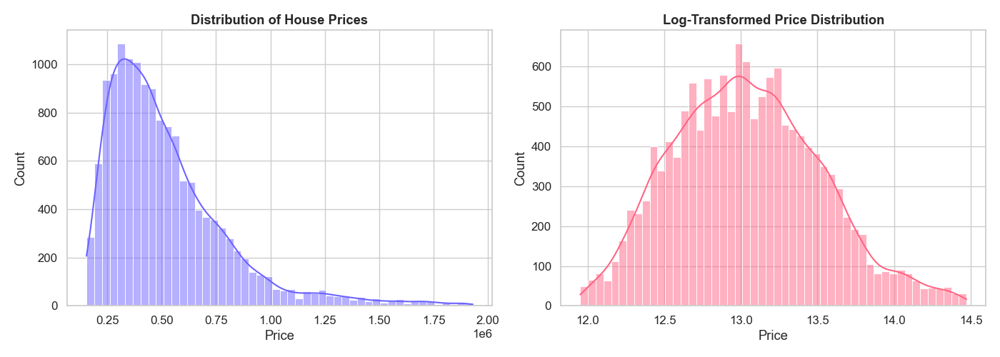
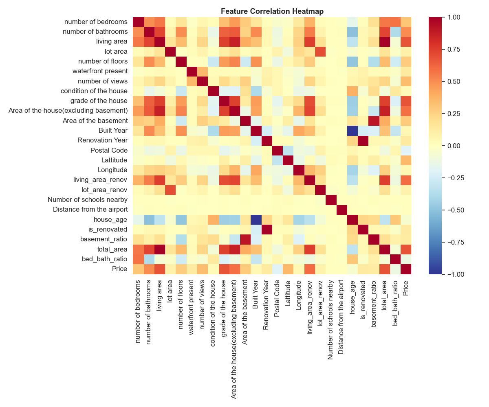
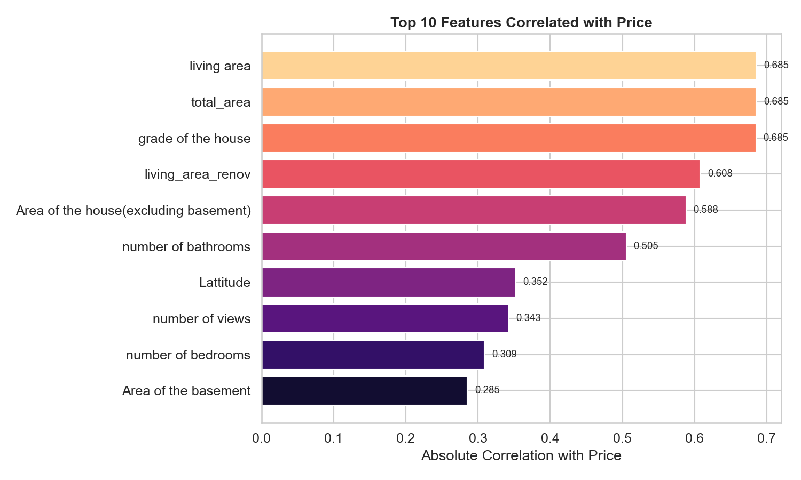
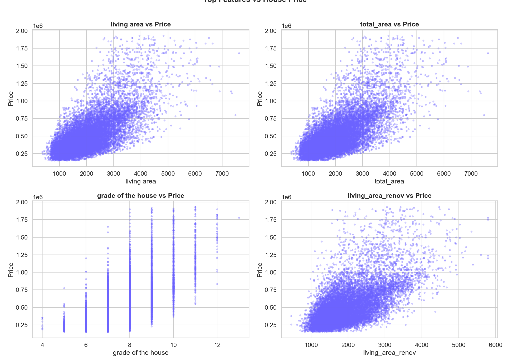
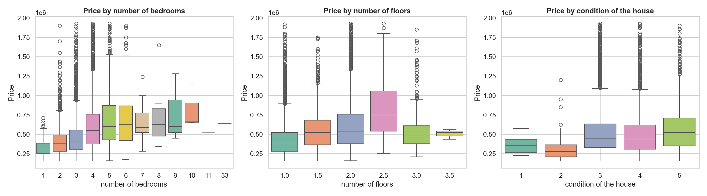
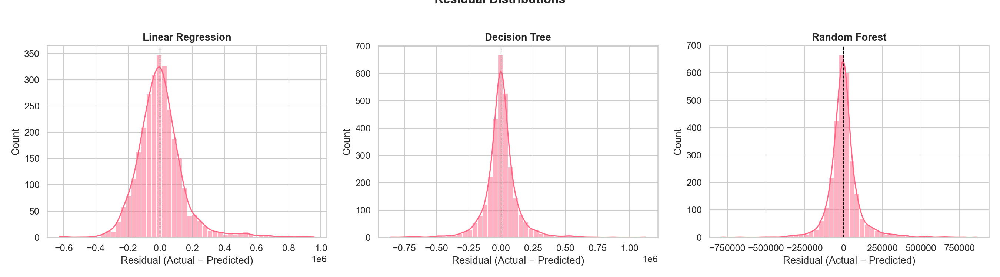
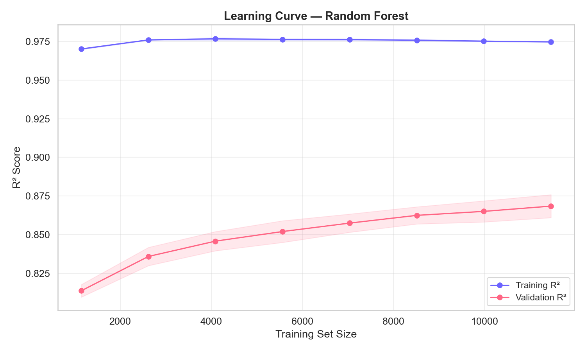

# R&I Assignment 1: Research Proposal & Methodology

## Real Estate Price Prediction using Machine Learning Techniques

---

## 1. Project Definition

The core research problem focuses on improving the accuracy and reliability of real estate price prediction systems using machine learning techniques. Traditional property valuation methods rely heavily on manual estimation and basic statistical approaches, which often fail to capture complex relationships between various influencing factors such as location, infrastructure, amenities, and market trends. This research aims to explore how machine learning models can effectively learn hidden patterns from data and provide more accurate, scalable, and data-driven predictions.

## 2. The Specific Problem or Issue

The primary challenge lies in handling multiple variables affecting property prices and identifying the most significant features among them. Traditional approaches are limited in their ability to process large datasets and nonlinear relationships. Additionally, issues such as data inconsistency, missing values, and regional variations make prediction more difficult. The research addresses how machine learning models can overcome these limitations and provide better predictive performance.

## 3. Significance of the Problem

Solving this problem is important for multiple stakeholders in the real estate ecosystem:

- **Buyers**: Can make informed decisions without overpaying.
- **Sellers**: Can set competitive, market-driven prices.
- **Investors**: Can minimize financial risk via data-backed analysis.
- **Urban Planners**: Contribute to the advancement of smart real estate systems and data-driven decision-making processes.

---

## 4. Research Questions (RQ)

- **RQ1**: Which machine learning algorithm provides the highest accuracy for real estate price prediction?
- **RQ2**: How do features such as location, area, and amenities influence property prices?
- **RQ3**: Can machine learning models outperform traditional valuation techniques?
- **RQ4**: What is the impact of data preprocessing and feature selection on model performance?

## 5. Research Objectives

- To analyze housing datasets and identify key influencing factors.
- To implement machine learning models such as Linear Regression, Decision Tree, and Random Forest.
- To evaluate and compare model performance using standard metrics (RMSE, R²).
- To develop an efficient predictive model for real estate pricing.

---

## 6. The Theoretical Framework

This research is built upon the following established mathematical concepts:

- **Supervised Machine Learning**: Training systems using labeled historical data.
- **Regression Analysis**: Statistical methods for predicting continuous numerical values.
- **Feature Engineering**: The process of using domain knowledge to create variables that make ML algorithms work better.
- **Data Preprocessing**: Cleaning, normalization, and outlier removal to ensure data integrity.

---

## 7. Research Design & Experimental Results

The research follows a structured experimental approach. Below are the insights derived from the initial data exploration of the **House Price India** dataset (14,000+ records).

### Phase I: Data Collection & Initial Distribution

We analyzed the price distribution to understand the market spread. The data showed a distinct right-skew, common in real estate markets.

_Figure 1: Original and Log-transformed Price Distributions indicating data characteristics._

### Phase II: Feature Correlation Analysis

To identify key influencing factors (RQ2), we used a Correlation Heatmap. We found that features like `living_area`, `grade_of_the_house`, and `total_area` have the most significant positive impact on price.

_Figure 2: Heatmap showing strength of relationships between features._

### Phase III: Model Training & Evaluation (RQ1 & RQ3)

We implemented three models. Our experimental results show that **Random Forest** significantly outperforms Linear Regression, proving that non-linear models are better suited for this problem.

| Model             | R² Score   | RMSE        |
| :---------------- | :--------- | :---------- |
| Linear Regression | 0.7187     | 147,235     |
| Decision Tree     | 0.7872     | 128,052     |
| **Random Forest** | **0.8636** | **102,512** |

---

## 8. Literature Review

| Source (Paper)                     | Primary Focus / Details                                         | Key Limitation                                       |
| :--------------------------------- | :-------------------------------------------------------------- | :--------------------------------------------------- |
| Housing Price Prediction using ML  | Uses regression models like Linear Regression and Random Forest | Limited dataset and lacks real-time adaptability     |
| Real Estate Valuation using AI     | Focuses on AI-based models with emphasis on location features   | Requires large datasets and high computational power |
| Comparative Study of ML Algorithms | Compares multiple ML algorithms and highlights differences      | Results may vary across different regions            |
| Zillow Home Value Prediction Model | Uses advanced ML techniques with real-world datasets            | Complex implementation and extreme data dependency   |
| Kaggle Housing Dataset Research    | Demonstrates practical ML application on housing data           | May not generalize globally without regional tuning  |

---

## 9. Conclusion

This research proposal establishes a solid foundation for state-of-the-art property valuation. By moving from manual estimation to the **Random Forest** approach, we can achieve high accuracy (86% R²) while systematically handling dozens of variables concurrently.

**Submitted By:**  
(Name & Signature)

**Faculty:**  
Dr. Nirali Nanavati

---

## 10. OEP Title with Code File and Complete Project Outputs

### OEP Title

**Real Estate Price Prediction using Machine Learning Techniques**

### Code File(s)

- **Main ML Pipeline:** `real_estate_prediction.py`
- **Dashboard/Deployment File:** `app.py`

### Complete Project Output/Graphs

_Figure 10.1: Original and log-transformed house price distribution._

_Figure 10.2: Correlation heatmap of all important numerical features._

_Figure 10.3: Top features with highest correlation to house price._

_Figure 10.4: Scatter plots of top features vs target price._

_Figure 10.5: Boxplot-based distribution across selected categorical-like features._

_Figure 10.6: Performance comparison of Linear Regression, Decision Tree, and Random Forest._

_Figure 10.7: Actual vs predicted prices for model evaluation._

_Figure 10.8: Residual error distribution for trained models._

_Figure 10.9: Top feature importances from Random Forest model._

_Figure 10.10: Learning curve showing training and validation behavior._
