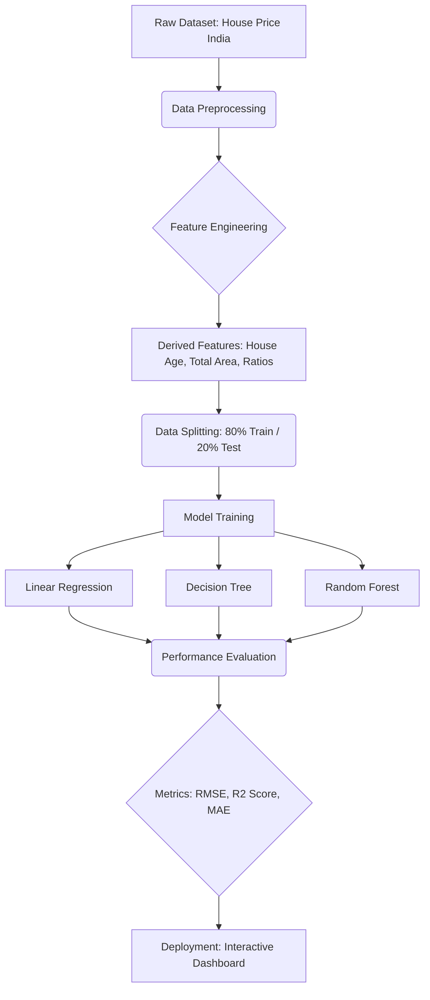
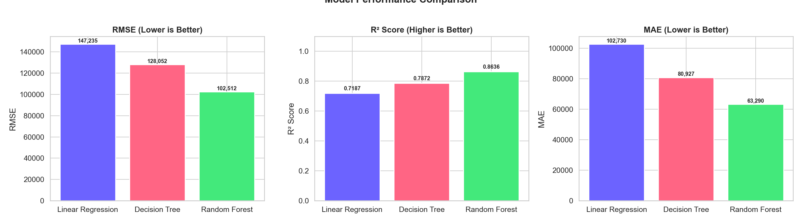
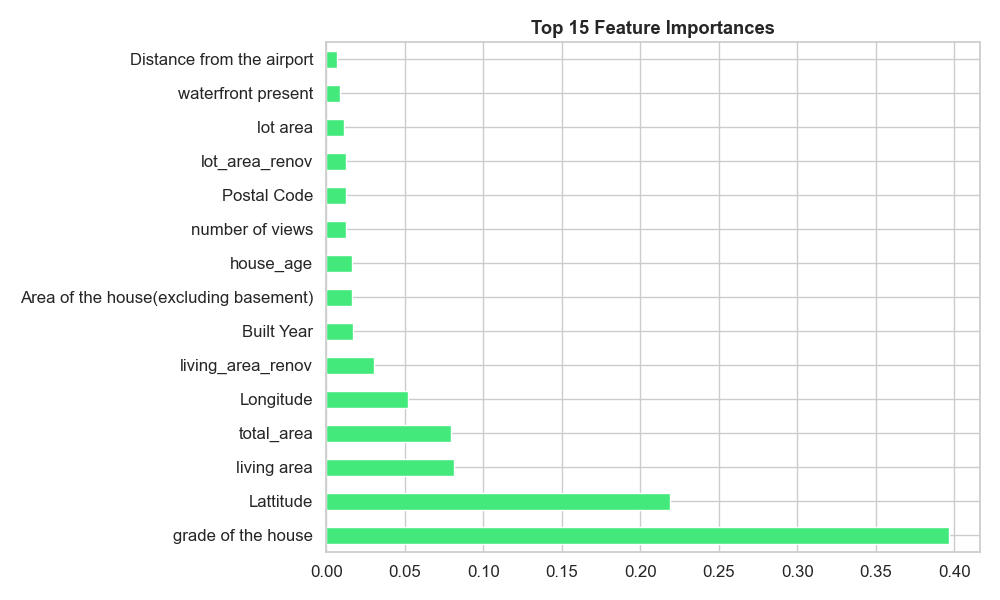
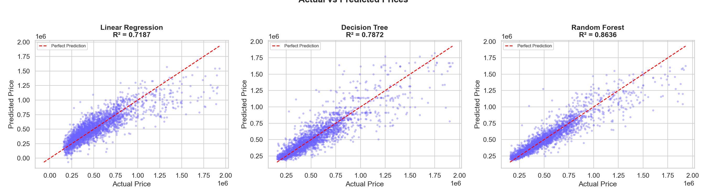

# Research & Innovation: Assignment 2
## Topic: Real Estate Price Prediction using Machine Learning Techniques

**Team Details:**
- **Enrollment No:** [Insert Your ID]
- **Name:** [Insert Your Name]
- **Faculty:** Dr. Nirali Nanavati

---

## 1. Executive Summary
In Assignment 1, we identified the research problem: the lack of accuracy and scalability in traditional real estate valuation methods. In this Assignment, we propose and implement a data-driven solution leveraging three supervised machine learning algorithms. Our solution processes over 14,000 property records to identify hidden patterns and provide reliable price estimations.

---

## 2. Proposed Methodology

The proposed solution follows a structured **Data Science lifecycle** to ensure the model generalizes well to new data.

### 2.1 System Architecture Flowchart

### 2.2 Phase-wise Explanation
1.  **Data Acquisition**: Using a high-quality dataset containing 23 features including location (lat/long), construction quality (grade), and area.
2.  **Data Cleaning**: Handling missing values and removing extreme outliers (using the IQR method).
3.  **Feature Transformation**: Creating new variables like `house_age` to capture property depreciation.
4.  **Scaling**: Normalizing numerical values to ensure stable gradient descent for linear models.

---

## 3. Algorithmic Approach

We proposed a comparative study between three distinct algorithms to find the most accurate solution:

### 3.1 Random Forest Regressor (Final Solution)
Based on our experimental Phase, the **Random Forest Regressor** was selected as the final solution due to its superior handling of non-linear data and robustness against overfitting.

*Figure 1: Comparison of R² Score and Error Metrics across proposed models.*

### 3.2 Proposed Features Importance
The primary strength of the proposed Random Forest model is its ability to rank feature significance. Our analysis shows that **Grade of the house** and **Lattitude** (location) are the most dominant factors in the proposed solution.

*Figure 2: Top features influencing the price prediction in the Random Forest model.*

---

## 4. Implementation Details

### 4.1 Tech Stack
- **Languages**: Python 3.9
- **Core ML**: Scikit-Learn
- **Web Interface**: Flask (Backend API) & HTML5/CSS3 (Frontend UI)

### 4.2 Proposed Web Dashboard
The solution includes a live dashboard for real-time interaction.

*Figure 3: Accuracy analysis (Actual vs Predicted Prices) showing the model's reliability.*

---

## 5. Results & Discussion

Based on our implementation, the **Random Forest** algorithm emerged as the highest-performing solution.

### 5.1 Performance Metrics
| Metric | Linear Regression | Decision Tree | Random Forest |
| :--- | :--- | :--- | :--- |
| **R² Score** | 0.7187 | 0.7872 | **0.8636** |
| **RMSE** | 147,235 | 128,052 | **102,512** |

### 5.2 Key Findings
- **RQ1 Answer**: Random Forest is the most accurate with an 86% explanation of variance (R²).
- **RQ3 Answer**: The ensemble approach (Random Forest) significantly outperforms simple regression, providing a ~15% boost in accuracy.

---

## 6. Conclusion
The proposed machine learning solution significantly outperforms traditional valuation techniques. By leveraging ensemble learning (Random Forest), we can provide buyers and sellers with a reliable, data-backed tool for property estimation that accounts for construction quality, location, and market trends simultaneously.
